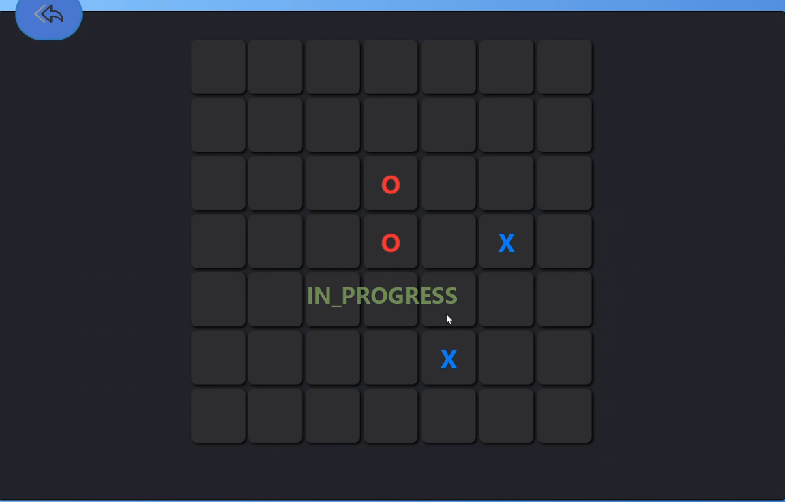

# 7×7 Tic-tac-toe game
This is a simple demonstration of using AI in games, as we implemented a Minimax algorithm to act as an AI to play against.

## Team Members

Names | id
----- | ----
Ahmed Mohammed Bakr Ahmed | 2000037
Mahmoud Mohamed Ali Soliman  | 2001866
Mahmoud Mohamed Mahmoud Ahmed | 2001261
Mohamed Yaser Elsaid Mahmoud | 2001226

## implementation
- for first prototype we used Python to build a console application, to verify our scoring system is working correctly
    - it can be found in console demo folder
+ for working EXE we used Java and JavaFX for building GUI **make sure JRE is installed**

## algorithms implemented :
+ the comparison is based on hard level, and 5 games were played

points &nbsp;&nbsp;&nbsp;&nbsp;&nbsp;&nbsp;&nbsp;&nbsp;&nbsp;&nbsp;&nbsp;&nbsp;&nbsp;&nbsp;&nbsp;&nbsp;&nbsp;&nbsp;&nbsp;&nbsp;&nbsp;&nbsp;&nbsp;&nbsp;&nbsp;&nbsp;&nbsp; &nbsp; &nbsp;&nbsp;&nbsp;&nbsp;  |Minimax  &nbsp;&nbsp;&nbsp;&nbsp;&nbsp;&nbsp;&nbsp;&nbsp;&nbsp;&nbsp;&nbsp;&nbsp;&nbsp;| Minimax with $\alpha$ - $\beta$ pruning  &nbsp;&nbsp;&nbsp;&nbsp;&nbsp;&nbsp;&nbsp;&nbsp;&nbsp;&nbsp;&nbsp; | Iterative deepning Minimax with $\alpha$ - $\beta$ pruning&nbsp;&nbsp;&nbsp;&nbsp;&nbsp;&nbsp;&nbsp;&nbsp;&nbsp;&nbsp;
----------------- |------------- | -------- | -----------------------
computer win rate | 100% | 80% | 80% 
speed  | Super Slow | averge | Slow

## game play
- Game modes:

- Levels :

- During Game :

## report link and demo video
[Report](https://docs.google.com/document/d/1crVvqlV2qVmR3F9MYQyW7L-jgZnX5bk0xmdaCodlEYw/edit?usp=sharing)
[Video]()